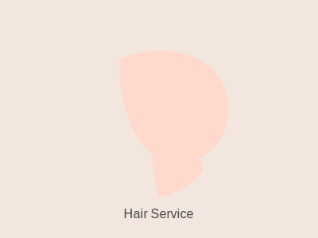

# Salon o Female Website - Customization Guide

This guide provides step-by-step instructions for customizing the Salon o Female website to fit your brand and business needs.

## Table of Contents
1. [General Customization](#general-customization)
2. [Changing Images](#changing-images)
3. [Updating Services](#updating-services)
4. [Modifying Team Members](#modifying-team-members)
5. [Editing Testimonials](#editing-testimonials)
6. [Special Offers](#special-offers)
7. [Contact & Booking Forms](#contact--booking-forms)
8. [Colors and Styling](#colors-and-styling)
9. [Social Media & Instagram Feed](#social-media--instagram-feed)
10. [Adding/Removing Pages](#addingremoving-pages)

## General Customization

Most content can be edited directly in the HTML files (`index.html`, `service-menu.html`, etc.). Open the file in a code editor and update the text, images, and links as needed.

## Changing Images

All images and icons are stored in the `assets` folder. To replace an image:
- Use the same filename, or update the `src` attribute in the HTML/CSS files.
- Recommended sizes:
  - Hero/Story images: 1200x800px or SVG
  - Team/Testimonial photos: 100x100px (square)
  - Service/Offer images: 300x200px

## Updating Services

1. Open `service-menu.html` and/or the relevant section in `index.html`.
2. Each service is represented by a card structure:
   ```html
   <div class="service-card">
     
     <h3>Service Name</h3>
   </div>
   ```
3. Update the image, service name, and description as needed.

## Modifying Team Members

1. Find the "Meet Our Stylists" section in `index.html`.
2. Each stylist is a card:
   ```html
   <div class="team-card">
     
     <h3>Stylist Name</h3>
     <p>Role/Expertise</p>
   </div>
   ```
3. Update the image, name, and role for each stylist.

## Editing Testimonials

1. Locate the "Client Testimonials" section in `index.html`.
2. Each testimonial is a card:
   ```html
   <div class="testimonial-card">
     
     <blockquote>"Testimonial text."</blockquote>
     <span>Client Name</span>
   </div>
   ```
3. Update the image, testimonial text, and client name.

## Special Offers

1. Find the "Special Offers" section in `index.html`.
2. Each offer is a card:
   ```html
   <div class="offer-card">
     
     <div class="offer-details">
       <h3>Offer Title</h3>
       <p>Offer description.</p>
       <a href="#" class="btn btn-primary">Book Now</a>
     </div>
   </div>
   ```
3. Update the image, title, description, and link as needed.

## Contact & Booking Forms

- Update contact details in `contact.html` and booking form in `book.html`.
- Change email, phone, address, and working hours as needed.
- For form actions, you may need to integrate with a backend or third-party service for submissions.

## Colors and Styling

- Open `css/style.css`.
- Edit the `:root` section to change color variables:
  ```css
  :root {
    --color-primary: #ffded4;
    --color-secondary: #f3b4a4;
    --color-accent: #e67553;
    /* ...other variables... */
  }
  ```
- Adjust font families, border radius, and transitions as desired.

## Social Media & Instagram Feed

- Update Instagram images in the `assets` folder and their references in the HTML.
- Change social media links in the footer section of `index.html`.

## Adding/Removing Pages

- To add a new page, create a new HTML file and link it in the navigation.
- To remove a page, delete the file and remove its link from the navigation.

## Example Images

- Waxing: 
- Eyebrow Threading: 
- Special Offer 2: 
- Special Offer 3: 

---

For advanced customizations, edit the CSS and JS files in the `css/` and `js/` folders. Always keep a backup before making major changes.
