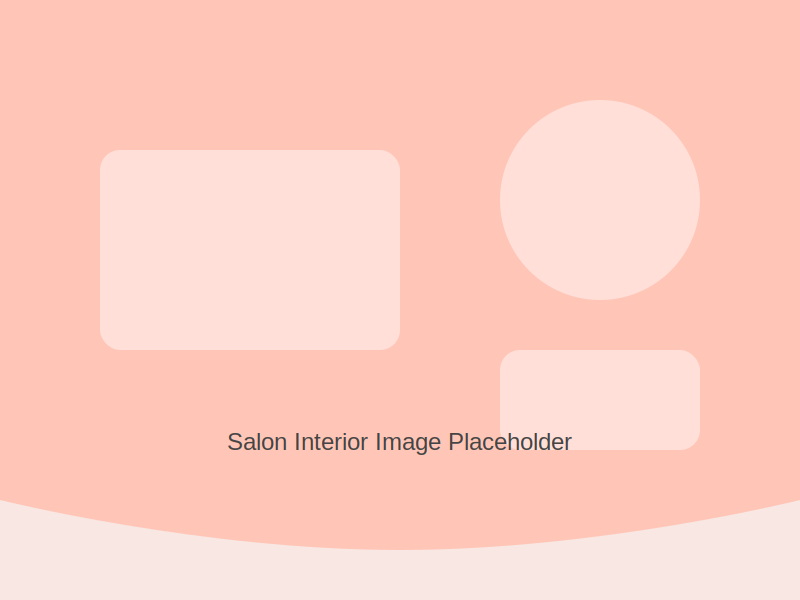
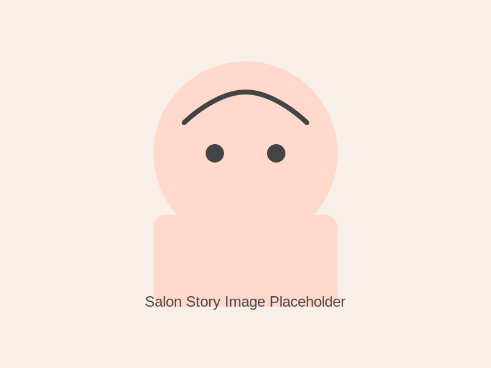

# Salon o Female

A modern, responsive website template for a women's salon, built with HTML, CSS, and JavaScript. Perfect for showcasing services, team, testimonials, and special offers.

## Features

- **Responsive Design**: Looks great on mobile, tablet, and desktop
- **Modern UI**: Elegant, clean, and professional design
- **Service Listings**: Highlight all salon services with images
- **Team Highlights**: Meet our stylists section
- **Client Testimonials**: Showcase client feedback
- **Special Offers**: Display current deals and promotions
- **Instagram Feed**: Social media gallery section
- **Contact & Booking**: Easy-to-use contact and booking forms
- **Back to Top Button**: Smooth navigation experience

## Technical Specifications

- HTML5, CSS3, JavaScript (ES6+)
- Custom CSS (no frameworks)
- Responsive grid and flex layouts
- Modern CSS variables and transitions
- SEO-friendly structure

## File Structure

```
index.html              # Home page
book.html               # Booking page
contact.html            # Contact page
our-story.html          # About/Story page
service-menu.html       # Services page
├── css/
│   ├── style.css           # Main stylesheet
│   ├── book.css            # Booking page styles
│   ├── contact.css         # Contact page styles
│   ├── our-story.css       # Story page styles
│   └── service-menu.css    # Services page styles
├── js/
│   └── main.js             # Main JS functionality
│   └── book.js             # Booking page JS
├── assets/
│   ├── *.svg, *.jpg        # Images and icons
└── pages/
    └── contact.html        # Additional contact page
```

## How to Use

1. **Clone the repository**
   ```
   git clone https://github.com/itsMannuYadav/Salon-o-Female.git
   ```

2. **Open the website**
   - Open the `index.html` file in any modern web browser

3. **Customization**
   - Replace images in the `assets` folder with your own
   - Update service listings, team members, and testimonials in the HTML files
   - Adjust colors and fonts in the CSS files to match your brand
   - Edit contact and booking forms as needed

## Browser Compatibility

- Chrome (latest)
- Firefox (latest)
- Safari (latest)
- Edge (latest)
- Opera (latest)

## License

This project is available for personal and commercial use.

## Contact

For any questions or customizations, contact:
- Email: info@salonofemale.com
- Phone: +91 98765 43210

---



